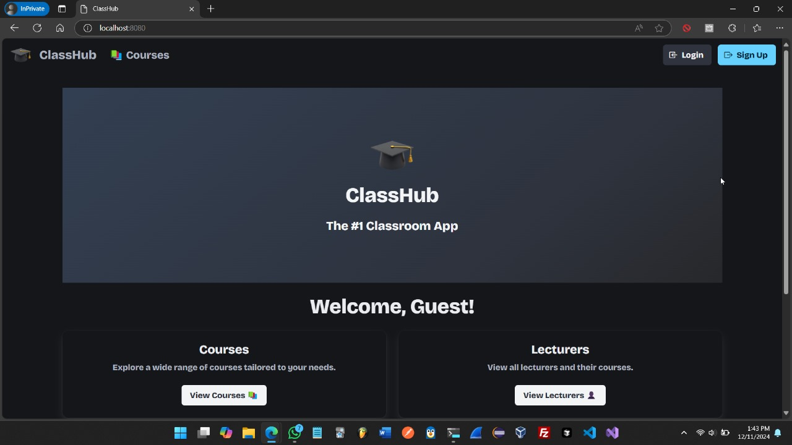

# GO-Classroom

## Introduction

An academic final project to learn framework developping in GO by Enzo and Robin.
To do this, the framework Gin was used, along with Gorm, which is a library that is a user-friendly ORM implementation. It enables easy model and database interaction.

This web application allows lecturers to make and edit posts about their classes which only the students who attend this class can see. Users can sign-in and login to the website.

Here is a youtube link for a demo.
https://youtu.be/F_gyMNhuAS8

## Pages

THere are pages to see the different courses and their posts, and pages to see the different lecturers.

There are also a sign-in and login pages.
